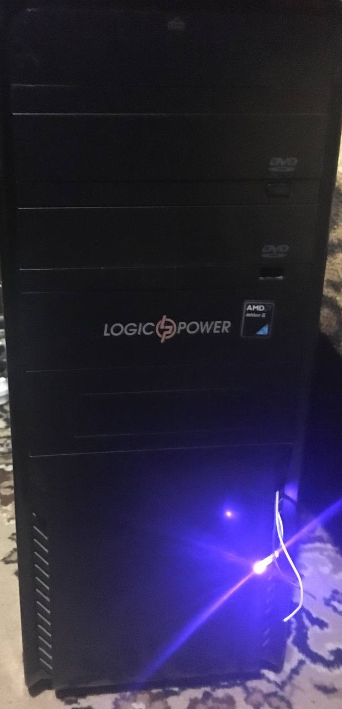
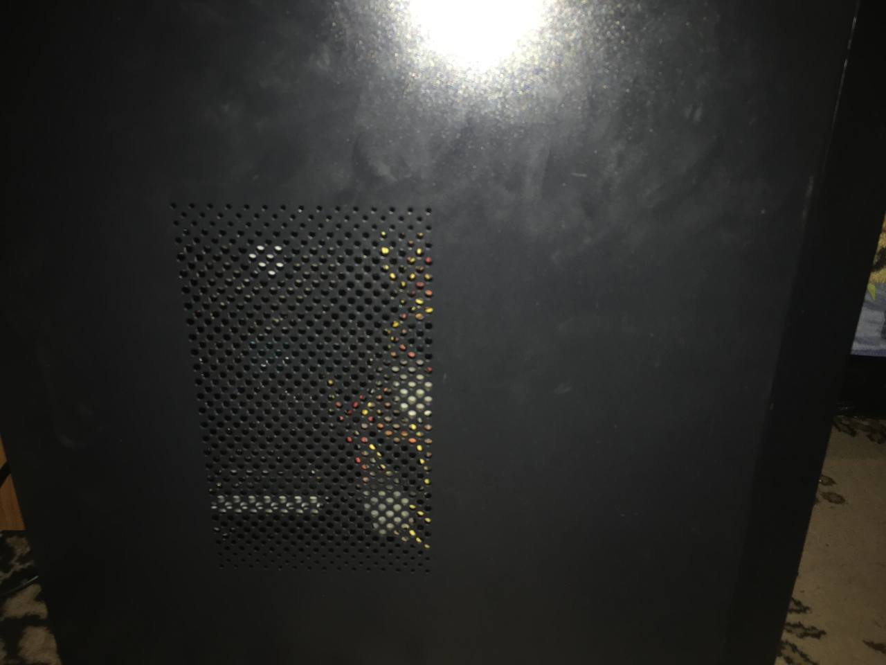
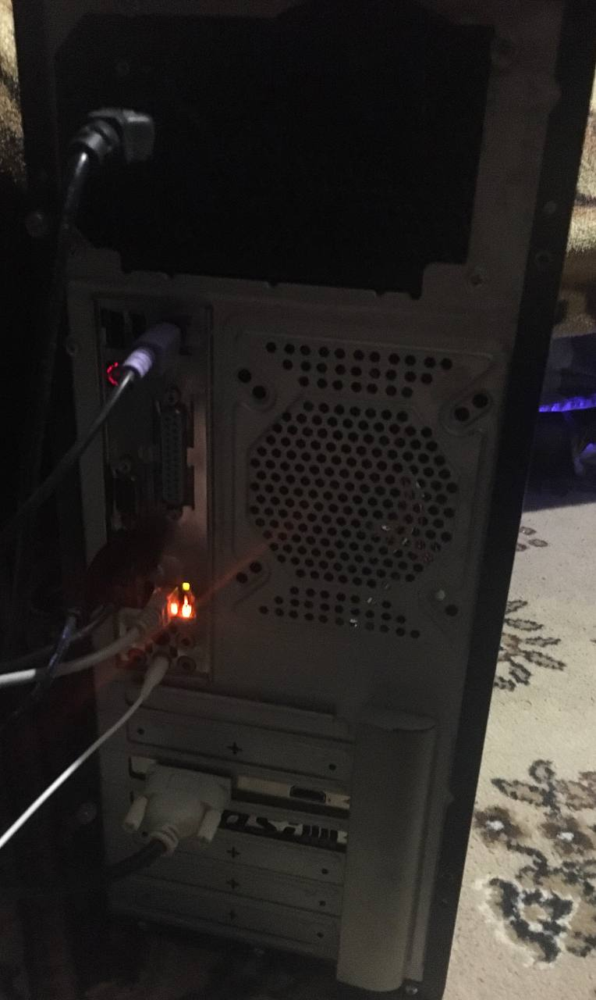

# My-PC
## Характеристики PC
- __Материнська плата__-Asus M4A77TD.
- __Відеокарта__-NVIDIA GeForce GT 1030 2гб.
- __Процесор__-AMD Athlon(tm) II X3 450 Processor.
- __RAM__-DIMM2: Corsair Vengeance CMZ8GX3M2A1600C9 4000мб.
- __Жорсткий диск__-SAMSUNG HD502HJ ATA Device.
- __Обєм пам'яті__-500гб.
- __Блок живлення__-VENDETA 400w.
## Фото PC

## Це [посилання на відеоогляд]([https://example.com](https://classroom.google.com/u/1/c/NjQzMjI1NTYyNjEw/a/NjQzMjI1NTYyNzAz/details)https://classroom.google.com/u/1/c/NjQzMjI1NTYyNjEw/a/NjQzMjI1NTYyNzAz/details).

